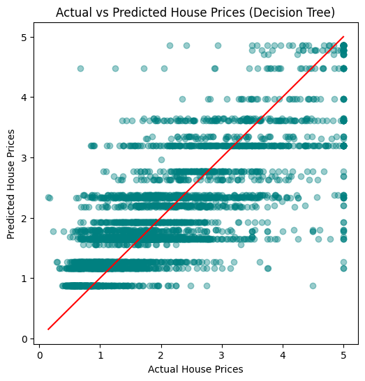

# 🏠 California Housing — Model Comparison & Optimization

## 📋 Project Overview
This project builds on the initial House Price Prediction model by introducing **feature engineering, feature scaling, and multi-model comparison** — mirroring how Machine Learning engineers optimize models in real-world projects. Completed as part of the **Artificial Intelligence & Machine Learning Internship** at **Maincrafts Technology**.

## 🎯 Objective
To move beyond a single baseline model and learn the professional ML workflow:
- Prepare data correctly for Machine Learning (feature scaling)
- Train and compare multiple regression algorithms
- Select the best-performing model using measurable evaluation metrics

## 🛠️ Tools & Libraries
- Python
- Pandas, NumPy
- Scikit-learn (StandardScaler, LinearRegression, Ridge, DecisionTreeRegressor)
- Matplotlib
- Google Colab

## 📊 Dataset
California Housing dataset (built into scikit-learn) — 20,640 records with features including median income, house age, average rooms, population, and location-based attributes. Target variable: **Median House Value**.

## 🔍 Key Steps
1. **Import & Load Data** — Loaded dataset using `fetch_california_housing()`
2. **Feature/Target Separation** — Split data into input features (X) and target (y)
3. **Feature Scaling** — Applied `StandardScaler` to normalize all features to a common scale, preventing any single feature from dominating model training
4. **Train/Test Split** — 80/20 split for reliable, unbiased evaluation
5. **Multi-Model Training** — Trained three regression models:
   - **Linear Regression** — baseline model
   - **Ridge Regression** (α=1.0) — reduces overfitting via regularization
   - **Decision Tree Regressor** (max_depth=5) — captures non-linear relationships
6. **Model Comparison** — Evaluated all models using RMSE and R² Score
7. **Visualization** — Plotted Actual vs Predicted values for the best-performing model

## 📈 Model Performance Comparison

| Model | RMSE | R² Score |
|---|---|---|
| Linear Regression | 0.745581 | 0.575788 |
   | Ridge Regression | 0.745554 | 0.575819 |
   | **Decision Tree** ✅ | **0.724234** | **0.599732** |

 
## 🏆 Best Model
**Decision Tree Regressor** was selected as the best-performing model based on the lowest RMSE and highest R² Score.

## 📊 Visualization

### Actual vs Predicted House Prices (Decision Tree — Best Model)

A closer alignment of points to the red reference line indicates better predictive performance.

## 💡 Key Insights
- Feature scaling was essential — without it, features like `Population` (range: 3–35,682) would have dominated smaller-scale features like `AveRooms` (range: 1–10)
- Ridge Regression's regularization helped stabilize predictions by penalizing large coefficients
- Decision Tree captured non-linear patterns that linear models couldn't, but required depth control (`max_depth=5`) to avoid overfitting

## 📁 Files
- `AI_ML_Task2_Model_Comparison.ipynb` — Full Jupyter Notebook with preprocessing, model training, comparison, and evaluation

## 🚀 How to Run
https://colab.research.google.com/github/khushisingh916228-droid/California-Housing-Model-Comparison/blob/main/AI_ML_Task2_Model_Comparison.ipynb

1. Click the badge above
2. Run all cells (`Runtime → Run all`)
3. Dataset loads automatically via scikit-learn — no manual download needed

## ✅ Skills Demonstrated
- Feature Scaling & Data Preprocessing
- Multi-Model Training (Linear, Ridge, Tree-based)
- Regularization Concepts (Ridge Regression)
- Overfitting Prevention (max_depth tuning)
- Model Evaluation & Comparison (RMSE, R²)
- Data-Driven Model Selection
